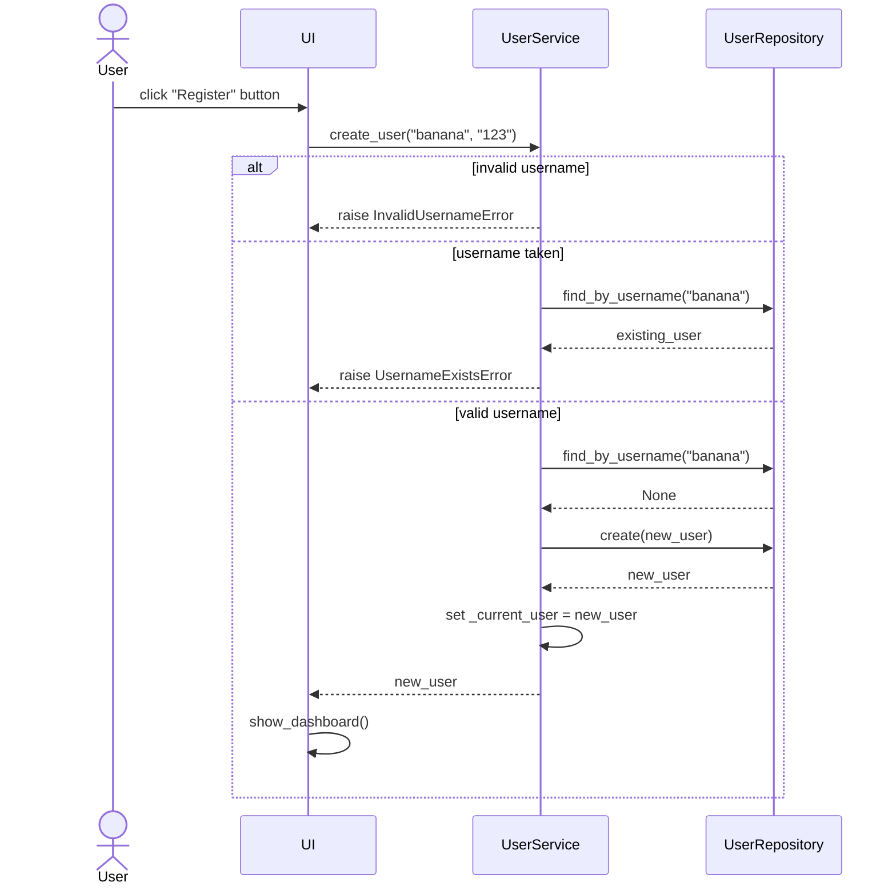
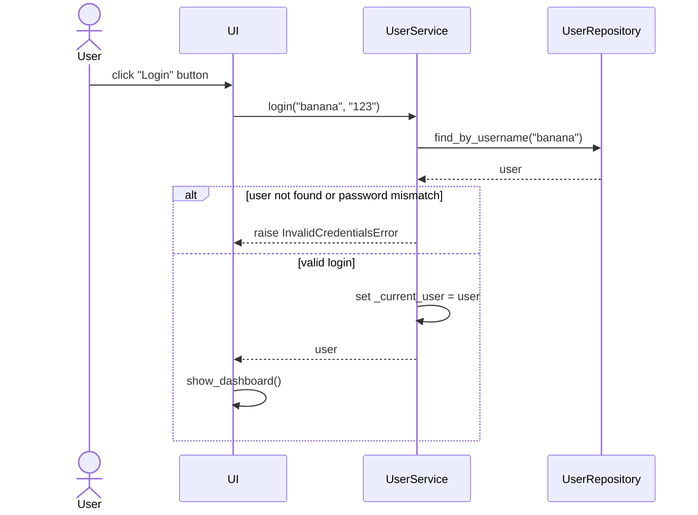

## Package diagram

## Main Function
User Registration：

```mermaid
sequenceDiagram
  actor User
  participant UI
  participant UserService
  participant UserRepository

  User->>UI: click "Register" button
  UI->>UserService: create_user("banana", "123")

  alt invalid username
    UserService-->>UI: raise InvalidUsernameError
  else username taken
    UserService->>UserRepository: find_by_username("banana")
    UserRepository-->>UserService: existing_user
    UserService-->>UI: raise UsernameExistsError
  else valid username
    UserService->>UserRepository: find_by_username("banana")
    UserRepository-->>UserService: None
    UserService->>UserRepository: create(new_user)
    UserRepository-->>UserService: new_user
    UserService->>UserService: set _current_user = new_user
    UserService-->>UI: new_user
    UI->>UI: show_dashboard()
  end

```
User Login：

```mermaid
sequenceDiagram
  actor User
  participant UI
  participant UserService
  participant UserRepository

  User->>UI: click "Login" button
  UI->>UserService: login("banana", "123")
  UserService->>UserRepository: find_by_username("banana")
  UserRepository-->>UserService: user

  alt user not found or password mismatch
    UserService-->>UI: raise InvalidCredentialsError
  else valid login
    UserService->>UserService: set _current_user = user
    UserService-->>UI: user
    UI->>UI: show_dashboard()
  end
```
