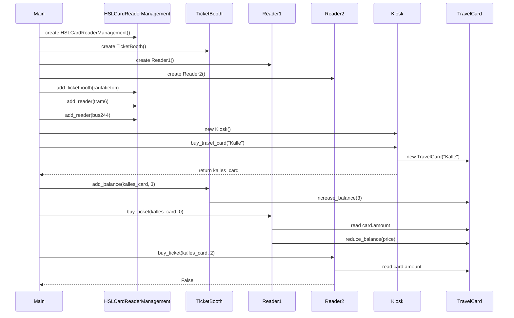

```mermaid
  sequenceDiagram
    participant Main
    participant Management as HSLCardReaderManagement
    participant Rautatietori as TicketBooth
    participant Tram6 as Reader1
    participant Bus244 as Reader2
    participant Kiosk1 as Kiosk
    participant KallesCard as TravelCard

    Main->>Management: create HSLCardReaderManagement()
    Main->>Rautatietori: create TicketBooth()
    Main->>Tram6: create Reader1()
    Main->>Bus244: create Reader2()

    Main->>Management: add_ticketbooth(rautatietori)
    Main->>Management: add_reader(tram6)
    Main->>Management: add_reader(bus244)

    Main->>Kiosk1: new Kiosk()
    Main->>Kiosk1: buy_travel_card("Kalle")
    Kiosk1->>KallesCard: new TravelCard("Kalle")
    Kiosk1-->>Main: return kalles_card

    Main->>Rautatietori: add_balance(kalles_card, 3)
    Rautatietori->>KallesCard: increase_balance(3)

    Main->>Tram6: buy_ticket(kalles_card, 0)
    Tram6->>KallesCard: read card.amount
    Tram6->>KallesCard: reduce_balance(price)

    Main->>Bus244: buy_ticket(kalles_card, 2)
    Bus244->>KallesCard: read card.amount
    Bus244-->>Main: False

```
