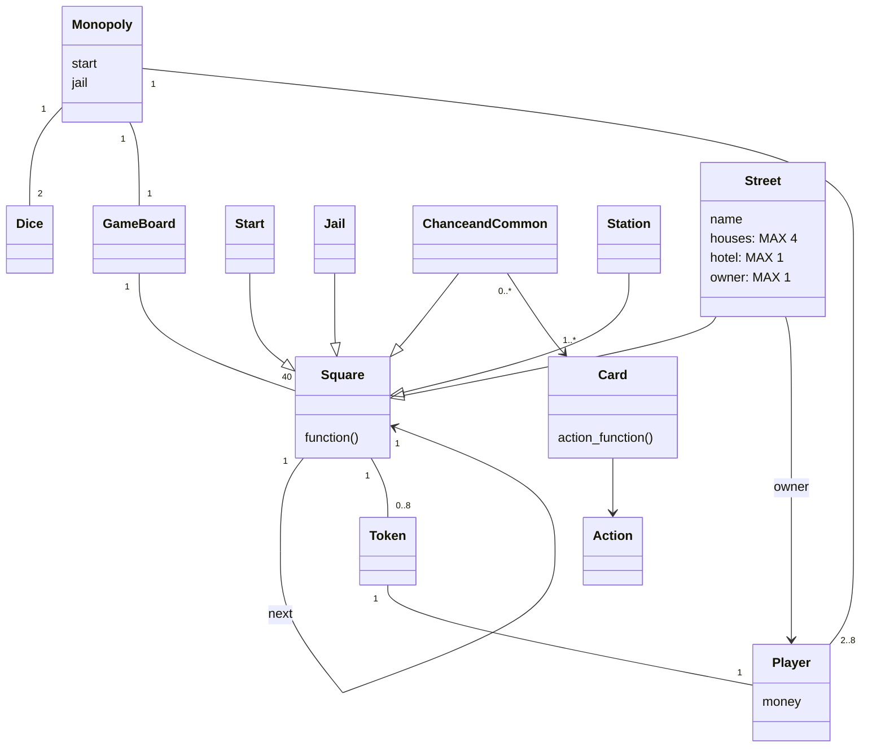

```mermaid
    
    classDiagram
        Monopoly "1" -- "2" Dice
        Monopoly "1" -- "1" GameBoard
        GameBoard "1" -- "40" Square
        Square "1" --> "1" Square : next
        Square "1" -- "0..8" Token
        Token "1" -- "1" Player
        Player "2..8" -- "1" Monopoly

        class Monopoly {
            start
            jail
        }
    
        class Dice
        class GameBoard
        class Square {
            function()
        }
        class Token
        class Player {
            money
        }
    
        Start --|> Square
        Jail --|> Square
        ChanceandCommon --|> Square
        Station --|> Square
        Street --|> Square

        class Start
        class Jail
        class Station
        class ChanceandCommon
        class Street {
            name
            houses: MAX 4
            hotel: MAX 1
            owner: MAX 1
        }

    
        
        ChanceandCommon "0..*" --> "1..*" Card
        Card --> Action
        Street --> Player : owner
        class Card {
            action_function()
        }
    
        class Action
```
